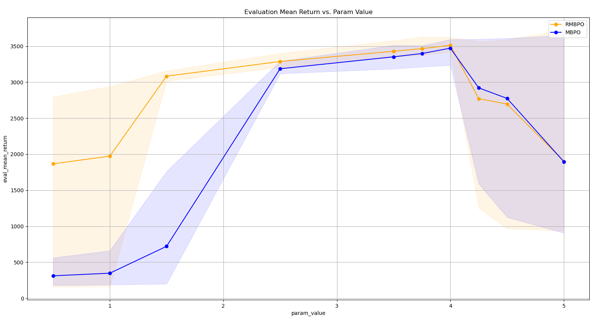

**Disclaimer**: this code has not been exhaustively tested. In case of issues, please start an issue on GitHub or contact the authors.

# Info
This code contains evaluation scripts and trained (policy) weights corresponding with the paper *Robust Model-Based Reinforcement Learning with an Adversarial Auxiliary Model*. Additionally, the distorted environments are provided. The code relies on the [Unstable Baselines library](https://github.com/x35f/model_based_rl/tree/2c2c4aca4952e3251fd77ba9413b72d25c033426).


# How to install

1. We assume that MuJoCo 2.1 is installed on your device, instructions can be found [here](https://github.com/openai/mujoco-py).

2. Install the conda environment and Unstable Baselines with the commands below:

```
conda env create -f env.yaml 
conda activate rmbpo
git clone --recurse-submodules https://github.com/x35f/unstable_baselines.git
pip install -e ./unstable_baselines
```

# How to run
Use the following structure:

```
python main_eval.py [PATH TO CONFIG] --load-dir1 ./[PATH TO RMBPO WEIGHTS] --load-dir2 [PATH TO MBPO WEIGHTS] --num-eval-runs [NUM OF DESIRED RUNS PER SEED]
```

E.g.

```
python main_eval.py configs/hopper-mass.py --load-dir1 ./weights/mu
joco-hopper/rmbpo/ --load-dir2 ./weights/mujoco-hopper/mbpo/ --num-eval-runs 10
```
,
should generate a *final_data.pkl* file and provide the following plot:

.